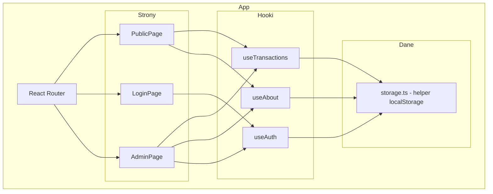

# Dokument Projektowy - Finance Tracker

## Overview

Prosta SPA (React + Vite + TypeScript) do śledzenia transakcji finansowych. Dane w localStorage. Jeden admin, reszta to widok publiczny. Minimalna liczba plików i abstrakcji — cel: szybka implementacja przy niskim zużyciu tokenów.

### Decyzje technologiczne

| Decyzja | Wybór | Uzasadnienie |
|---------|-------|--------------|
| Framework | React 18 + Vite | Szybki setup, zero konfiguracji |
| Język | TypeScript | Bezpieczeństwo typów |
| Stylowanie | Tailwind CSS | Szybkie pisanie UI bez osobnych plików CSS |
| Routing | React Router v6 | Standard SPA |
| Stan | React Context + useReducer | Wystarczające, zero zależności |
| Hashing | Web Crypto API (SHA-256) | Wbudowane w przeglądarkę |

### Zasady uproszczenia

- Jeden plik helpera do localStorage zamiast wzorca Repository
- Custom hooki zamiast osobnych serwisów
- Logika obliczeniowa inline w hookach (nie w osobnych plikach)
- Minimalna liczba komponentów — łączenie tam gdzie sensowne
- Brak property-based testing — proste testy manualne wystarczą na start

## Architecture



### Struktura katalogów

```
src/
├── components/
│   ├── Dashboard.tsx        # Statystyki + mapa cieplna
│   ├── TransactionList.tsx  # Lista transakcji (admin/public)
│   ├── TransactionForm.tsx  # Formularz dodawania/edycji
│   ├── Heatmap.tsx          # Mapa cieplna miesięczna
│   ├── AboutSection.tsx     # Sekcja "O mnie" (widok + edycja)
│   └── AuthGuard.tsx        # Ochrona tras admina
├── hooks/
│   ├── useAuth.ts           # Logowanie, sesja, guard
│   ├── useTransactions.ts   # CRUD transakcji + obliczenia + portfel + kategorie
│   └── useAbout.ts          # CRUD sekcji "O mnie"
├── pages/
│   ├── PublicPage.tsx       # Widok publiczny (stats + lista + heatmap + about)
│   ├── AdminPage.tsx        # Panel admina (dashboard + CRUD + portfel)
│   └── LoginPage.tsx        # Formularz logowania
├── lib/
│   ├── storage.ts           # Helper localStorage (get/set/remove z prefixem ft_)
│   ├── types.ts             # Wszystkie typy w jednym pliku
│   └── calculations.ts     # Funkcje obliczeniowe (zysk, dni, statystyki)
├── App.tsx                  # Router + Context providers
└── main.tsx                 # Entry point
```

**Łącznie ~15 plików źródłowych** — każdy z jasną odpowiedzialnością.

## Components and Interfaces

### storage.ts — helper localStorage

```typescript
const PREFIX = 'ft_';

export const storage = {
  get<T>(key: string, fallback: T): T,
  set(key: string, value: unknown): void,
  remove(key: string): void,
};
```

### types.ts — wszystkie typy

```typescript
export interface Transaction {
  id: string;
  number: number;
  title: string;
  description?: string;
  category?: string;
  status: 'Kupiono' | 'Sprzedano';
  purchasePrice: number;
  purchaseDate: string;
  salePrice?: number;
  saleDate?: string;
  profitPercent?: number;
  profitAmount?: number;
  daysHeld?: number;
}

export interface AboutData {
  description: string;
  socialLinks: { label: string; url: string }[];
}

export interface AppState {
  transactions: Transaction[];
  walletBalance: number;
  categories: string[];
  about: AboutData | null;
}
```

### Hooki

```typescript
// useAuth — zarządza logowaniem
useAuth(): {
  isAdmin: boolean;
  login(user: string, pass: string): Promise<boolean>;
  logout(): void;
}

// useTransactions — CRUD + obliczenia + portfel + kategorie
useTransactions(): {
  transactions: Transaction[];
  completed: Transaction[];
  walletBalance: number;
  categories: string[];
  stats: DashboardStats;
  add(input: TransactionInput): ValidationResult;
  update(id: string, input: TransactionInput): ValidationResult;
  remove(id: string): void;
}

// useAbout — sekcja "O mnie"
useAbout(): {
  about: AboutData | null;
  save(data: AboutData): ValidationResult;
}
```

## Data Models

### Struktura localStorage

```
ft_transactions  → Transaction[] (JSON)
ft_wallet        → number
ft_categories    → string[]
ft_about         → AboutData (JSON)
ft_credentials   → { usernameHash: string, passwordHash: string }
ft_session       → boolean
```

### Obliczenia (calculations.ts)

```typescript
export function calcProfit(purchase: number, sale: number): { percent: number; amount: number };
export function calcDaysHeld(purchaseDate: string, saleDate: string): number;
export function calcStats(transactions: Transaction[]): DashboardStats;
export function calcHeatmapData(transactions: Transaction[]): HeatmapMonth[];
```

## Error Handling

| Sytuacja | Obsługa |
|----------|---------|
| Uszkodzone dane localStorage | Fallback do pustego stanu + alert |
| Błąd walidacji formularza | Komunikaty przy polach |
| Nieprawidłowe logowanie | Ogólny komunikat błędu |
| localStorage pełny | Alert "Brak miejsca" |
| Nieautoryzowany dostęp do /admin | Redirect do /login |

## Testing Strategy

Brak automatycznych testów na start — priorytet to działająca aplikacja. Testy można dodać później gdy będzie backend. Walidacja manualna w przeglądarce.
