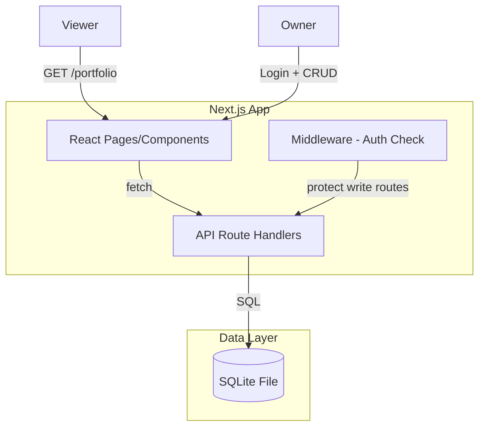

# Design Document: Financial Tracker

## Overview

A minimal personal finance tracker web application for a single owner. The app tracks buy/sell transactions, calculates profit/loss, organizes items into folders, and exposes a public read-only portfolio view.

**Design Philosophy**: Minimal complexity, zero recurring costs (self-hostable), single-file database, one framework for both frontend and backend.

**Tech Stack**:
- **Framework**: Next.js 14 (App Router) — handles UI, API routes, and SSR in one project
- **Database**: SQLite via better-sqlite3 — zero-cost, file-based, perfect for single-user
- **Styling**: Tailwind CSS — utility-first, no runtime cost
- **Auth**: Simple session cookie with bcrypt — one owner account, no OAuth complexity
- **Deployment**: Vercel or any Node.js host (SQLite file persists on disk)

## Architecture



**Request Flow**:
1. Owner logs in → session cookie set → full CRUD access
2. Viewer visits public URL → read-only portfolio rendered (no auth needed)
3. All mutations go through API routes protected by auth middleware
4. SQLite queries are synchronous (better-sqlite3), keeping things simple

**Key Decisions**:
- No ORM — raw SQL with better-sqlite3 for simplicity and control
- No external database — SQLite file in project directory
- No complex state management — server components + simple client state
- Session stored as signed HTTP-only cookie (no session table needed for single user)

## Components and Interfaces

### Pages (App Router)

| Route | Access | Description |
|-------|--------|-------------|
| `/` | Public | Portfolio view (read-only dashboard + items) |
| `/login` | Public | Login form |
| `/dashboard` | Owner | Summary + item management |
| `/dashboard/items` | Owner | Item list with CRUD |
| `/dashboard/items/new` | Owner | Add new item form |
| `/dashboard/items/[id]/edit` | Owner | Edit item form |
| `/dashboard/folders` | Owner | Folder management |

### API Routes

| Endpoint | Method | Auth | Description |
|----------|--------|------|-------------|
| `/api/auth/login` | POST | No | Authenticate owner |
| `/api/auth/logout` | POST | Yes | End session |
| `/api/items` | GET | No | List all items (portfolio) |
| `/api/items` | POST | Yes | Create item |
| `/api/items/[id]` | PUT | Yes | Update item |
| `/api/items/[id]` | DELETE | Yes | Delete item |
| `/api/folders` | GET | No | List folders |
| `/api/folders` | POST | Yes | Create folder |
| `/api/folders/[id]` | DELETE | Yes | Delete folder |
| `/api/summary` | GET | No | Get summary stats |

### Core Modules

```
src/
├── app/                    # Next.js App Router pages
│   ├── page.tsx           # Public portfolio
│   ├── login/page.tsx     # Login form
│   └── dashboard/         # Owner pages
├── lib/
│   ├── db.ts             # SQLite connection + query helpers
│   ├── auth.ts           # Session management (cookie sign/verify)
│   ├── validation.ts     # Input validation functions
│   └── profit.ts         # Profit calculation logic
└── components/            # Shared React components
```

### Key Interfaces

```typescript
// Item as stored in DB
interface Item {
  id: number;
  description: string;
  purchasePrice: number;      // stored as integer cents
  purchaseDate: string;       // ISO date string YYYY-MM-DD
  salePrice: number | null;   // stored as integer cents, null if active
  saleDate: string | null;    // ISO date string, null if active
  folderId: number | null;
  createdAt: string;
  updatedAt: string;
}

// Computed fields for display
interface ItemWithProfit extends Item {
  status: 'active' | 'sold';
  profitAmount: number | null;       // cents, null if active
  profitPercentage: number | null;   // percentage, null if active or purchasePrice=0
}

// Folder
interface Folder {
  id: number;
  name: string;
  createdAt: string;
}

// Summary
interface Summary {
  totalProfit: number;              // sum of all sold item profits (cents)
  totalActiveValue: number;         // sum of all active item purchase prices (cents)
  soldCount: number;
  activeCount: number;
}

// Validation
interface ValidationResult {
  valid: boolean;
  errors: Record<string, string>;   // field -> error message
}

// Item creation input
interface CreateItemInput {
  description: string;
  purchasePrice: number;    // user enters decimal, we convert to cents
  purchaseDate: string;
  folderId?: number | null;
}

// Item sale input
interface SellItemInput {
  salePrice: number;
  saleDate: string;
}
```

## Data Models

### SQLite Schema

```sql
CREATE TABLE items (
  id INTEGER PRIMARY KEY AUTOINCREMENT,
  description TEXT NOT NULL CHECK(length(description) BETWEEN 1 AND 500),
  purchase_price INTEGER NOT NULL CHECK(purchase_price BETWEEN 1 AND 999999999),
  purchase_date TEXT NOT NULL,
  sale_price INTEGER CHECK(sale_price IS NULL OR sale_price >= 1),
  sale_date TEXT,
  folder_id INTEGER REFERENCES folders(id) ON DELETE SET NULL,
  created_at TEXT NOT NULL DEFAULT (datetime('now')),
  updated_at TEXT NOT NULL DEFAULT (datetime('now'))
);

CREATE TABLE folders (
  id INTEGER PRIMARY KEY AUTOINCREMENT,
  name TEXT NOT NULL UNIQUE COLLATE NOCASE CHECK(length(name) BETWEEN 1 AND 50),
  created_at TEXT NOT NULL DEFAULT (datetime('now'))
);

CREATE TABLE owner (
  id INTEGER PRIMARY KEY CHECK(id = 1),
  username TEXT NOT NULL,
  password_hash TEXT NOT NULL
);
```

**Storage Decisions**:
- Prices stored as **integer cents** (avoids floating-point issues). `purchase_price = 1` means $0.01, `purchase_price = 999999999` means $9,999,999.99
- Dates stored as ISO strings (`YYYY-MM-DD`) — SQLite has no native date type
- `COLLATE NOCASE` on folder name handles case-insensitive uniqueness
- `ON DELETE SET NULL` on folder_id means deleting a folder unassigns items (doesn't delete them)
- Single row in `owner` table (CHECK constraint enforces id=1)

### Profit Calculation Logic

```typescript
function calculateProfit(purchasePrice: number, salePrice: number): {
  amount: number;
  percentage: number | null;
} {
  const amount = salePrice - purchasePrice;
  const percentage = purchasePrice > 0
    ? Math.round(((salePrice - purchasePrice) / purchasePrice) * 10000) / 100
    : null; // N/A when purchase price is 0
  return { amount, percentage };
}
```

### Validation Rules

| Field | Rule |
|-------|------|
| `description` | 1–500 characters, trimmed, non-empty after trim |
| `purchasePrice` | Numeric, 0.01–9,999,999.99 (1–999,999,999 cents) |
| `purchaseDate` | Valid date, not in the future |
| `salePrice` | Numeric, ≥ 0.01 (≥ 1 cent), required with saleDate |
| `saleDate` | Valid date, required with salePrice |
| `folderName` | 1–50 characters, unique (case-insensitive) |

## Correctness Properties

*A property is a characteristic or behavior that should hold true across all valid executions of a system — essentially, a formal statement about what the system should do. Properties serve as the bridge between human-readable specifications and machine-verifiable correctness guarantees.*

### Property 1: Status determination is consistent

*For any* Item with any combination of sale_price and sale_date values, the derived status SHALL be "active" if either sale_price or sale_date is null, and "sold" if and only if both sale_price and sale_date are non-null. No other status value is possible.

**Validates: Requirements 3.1, 3.2, 3.3, 3.4, 8.4**

### Property 2: Profit calculation correctness

*For any* Sold_Item with purchase_price P and sale_price S where P > 0, the profit amount SHALL equal S - P, and the profit percentage SHALL equal ((S - P) / P) * 100 rounded to 2 decimal places. If P = 0, profit percentage SHALL be null.

**Validates: Requirements 2.3, 2.4, 2.5, 8.3**

### Property 3: Validation rejects all invalid inputs

*For any* input where purchase_price is outside [1, 999999999] cents, OR purchase_date is in the future, OR description is empty or exceeds 500 characters, the validation function SHALL return invalid with an error referencing the specific invalid field(s).

**Validates: Requirements 1.2, 1.3, 1.4, 8.5**

### Property 4: Item creation round-trip

*For any* valid CreateItemInput, creating an item and then retrieving it SHALL return an item with matching description, purchase_price, purchase_date, status "active", and null sale fields.

**Validates: Requirements 1.1**

### Property 5: Selling an active item sets status to sold

*For any* Active_Item and valid sale input (sale_price ≥ 1 cent and valid sale_date), applying the sell operation SHALL result in the item having status "sold" with the provided sale_price and sale_date.

**Validates: Requirements 2.1, 2.2**

### Property 6: Summary aggregation correctness

*For any* set of Items, the total profit SHALL equal the sum of (sale_price - purchase_price) for all Sold_Items, and the total active value SHALL equal the sum of purchase_price for all Active_Items. For empty sets, both values SHALL be 0.

**Validates: Requirements 5.1, 5.2, 5.4, 5.5**

### Property 7: Folder name uniqueness is case-insensitive

*For any* existing folder with name N, attempting to create a folder with any case variation of N (e.g., uppercase, lowercase, mixed case) SHALL be rejected.

**Validates: Requirements 4.6**

### Property 8: Folder deletion preserves items

*For any* folder containing N items, deleting that folder SHALL result in all N items still existing with their folder_id set to null.

**Validates: Requirements 4.5**

### Property 9: Folder assignment replaces previous

*For any* Item assigned to Folder A, reassigning it to Folder B SHALL result in the item being associated only with Folder B and not with Folder A.

**Validates: Requirements 4.2, 4.3**

### Property 10: Write operations require authentication

*For any* mutation request (POST, PUT, DELETE to item/folder endpoints) without a valid session cookie, the API SHALL reject the request with an access denied response.

**Validates: Requirements 7.2**

### Property 11: Item deletion removes item and updates summary

*For any* list of items, deleting one item SHALL result in that item no longer appearing in the item list, and the summary values SHALL equal the recalculated aggregation over the remaining items.

**Validates: Requirements 8.2**

### Property 12: Item edit persists valid changes

*For any* existing Item and valid edit input, applying the edit SHALL result in the item reflecting the new values, while invalid edits SHALL leave the item unchanged.

**Validates: Requirements 8.1**

## Error Handling

### Validation Errors

| Scenario | Response | HTTP Status |
|----------|----------|-------------|
| Missing required fields | `{ errors: { field: "Required" } }` | 400 |
| Invalid field values | `{ errors: { field: "Reason" } }` | 400 |
| Duplicate folder name | `{ errors: { name: "Already exists" } }` | 409 |

### Authentication Errors

| Scenario | Response | HTTP Status |
|----------|----------|-------------|
| Invalid credentials | `{ error: "Invalid credentials" }` | 401 |
| No session / expired | `{ error: "Access denied" }` | 401 |
| Unauthenticated write attempt | `{ error: "Access denied" }` | 401 |

### Data Errors

| Scenario | Response | HTTP Status |
|----------|----------|-------------|
| Item not found | `{ error: "Not found" }` | 404 |
| Folder not found | `{ error: "Not found" }` | 404 |
| Database error | `{ error: "Internal error" }` | 500 |

**Error Design Principles**:
- Never reveal whether the owner account exists (Req 7.3)
- Always return structured error objects with field-level detail for validation
- Log server errors internally but return generic message to client
- Validation errors preserve form state on the client (don't clear fields)

## Testing Strategy

### Property-Based Tests (fast-check)

**Library**: [fast-check](https://github.com/dubzzz/fast-check) — mature PBT library for TypeScript/JavaScript

**Configuration**: Minimum 100 iterations per property test.

**Tag format**: `Feature: financial-tracker, Property {number}: {property_text}`

Property tests target the pure logic layer:
- `lib/validation.ts` — input validation (Properties 3, 5)
- `lib/profit.ts` — profit calculation (Property 2)
- Status derivation logic (Property 1)
- Summary aggregation logic (Property 6)
- Folder name comparison logic (Property 7)

### Unit Tests (vitest)

Example-based tests for:
- Specific validation edge cases (boundary values: 0.01, 9999999.99, 500-char description)
- Login/logout flow
- Session expiry behavior
- UI component rendering (confirmation messages, read-only mode)

### Integration Tests

- API route tests with supertest or Next.js test utilities
- Full CRUD flow: create → read → update → delete
- Auth middleware: verify protected routes reject unauthenticated requests
- Folder deletion cascade behavior
- Public portfolio data completeness

### Test Structure

```
tests/
├── properties/          # Property-based tests (fast-check)
│   ├── validation.prop.test.ts
│   ├── profit.prop.test.ts
│   ├── status.prop.test.ts
│   └── summary.prop.test.ts
├── unit/               # Example-based unit tests
│   ├── validation.test.ts
│   ├── profit.test.ts
│   └── auth.test.ts
└── integration/        # API integration tests
    ├── items.test.ts
    ├── folders.test.ts
    └── portfolio.test.ts
```

